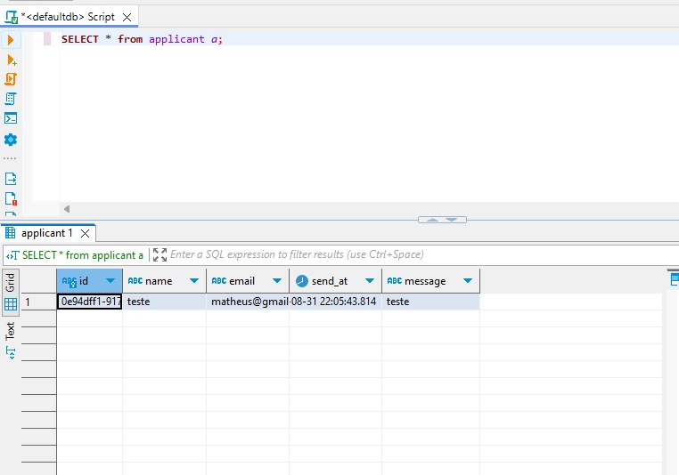
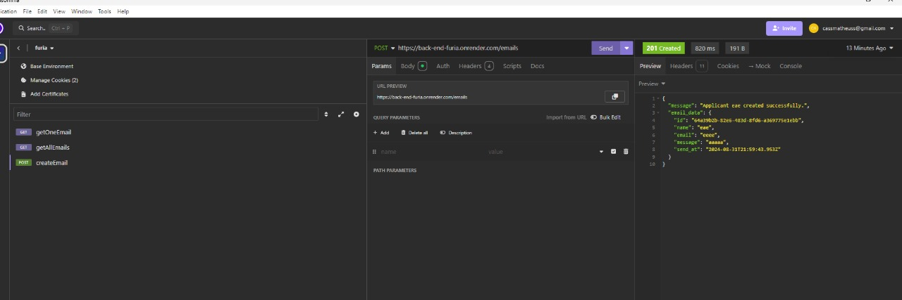

# FURIA Landing Page
Este projeto é uma landing page desenvolvida usando Next.js, TypeScript e Tailwind CSS.

# Tecnologias Utilizadas
Next.js: Framework React para renderização do lado do servidor e geração de sites estáticos.

TypeScript: Superset do JavaScript que adiciona tipagem estática.

React: Biblioteca para a construção de interfaces de usuário.

Tailwind CSS: Framework CSS utilitário para estilos rápidos e responsivos.

# Site Hospedado
Caso queira visitar o site já hospedado, aqui está o link: https://furia-landing-page.vercel.app/

# Backend com Nestjs apenas de demonstração
Foi feito também um backend simples, em que é possível fazer registrar nomes, emails e mensagens dos aplicantes da vaga pois achei interessante produzir um: https://github.com/cassmatheuss/back-end-furia

